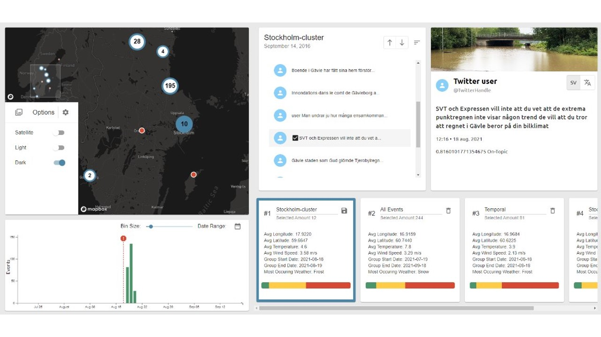

# AI4CA
This is a project from 2023 that me and two other developers worked on.
It is a web interface that shows flooding data and allows the user to filter, cluster and display information as well as save previous filters, to compare different searches.
The data points were scraped from twitter posts and have been ranked on their severity.

## Screenshot

## Authors
[Victor Imark](https://github.com/v-imark) & [Johan Bäcklund](https://github.com/Beckelund) & Henrik Gustafsson

### Origional Repo
https://github.com/v-imark/AI4CA